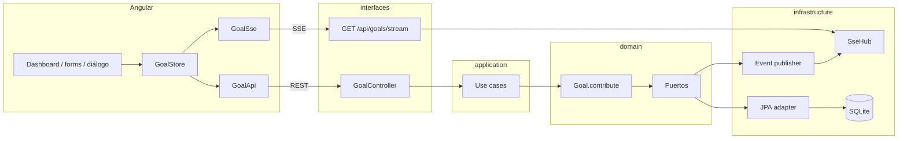

# Arquitectura

Un proceso Spring Boot (hexagonal lean) y Angular aparte. Un aggregate: `Goal`. La regla `current + amount ≤ target` vive en `Goal.contribute()`, no en el controller ni en SQL.

Por qué así: hay **un invariante que no puede mezclarse con el framework** y **dos detalles que sí cambian** (hoy SQLite, mañana Postgres; hoy SSE). El dominio no importa Spring ni JPA. Habla por puertos (`GoalRepository`, `GoalEventPublisher`). Un monolito alcanza: un usuario, un flujo, un deploy. Layered Spring metería la regla en un `@Service`; microservicios o Kafka serían teatro para un abono.

Flujo: REST → use case → `Goal` → `save` → `publish`. El aviso no sale del use case: evento de dominio → listener → `SseHub` → `EventSource`. El `@Entity` es DTO de tabla; el aggregate se reconstruye con `Goal.rehydrate`.

## Tiempo real

Comandos por REST (`POST /api/goals`, `POST .../contributions`). Avisos por SSE (`GET /api/goals/stream`: `goal-updated`, `goal-completed`). SSE es un tubo servidor→browser; el cliente ya escribe por HTTP, así que WebSocket no aporta. El diálogo de 100% se abre con `goal-completed` del stream, no con el JSON del POST: las dos pestañas se enteran igual. Si el push falla, el abono **ya** está persistido (sin outbox: se puede perder el aviso, no el dinero).

## Persistencia y BD

SQLite en `apps/backend/data/bolsillo.db` (sin Docker). Esquema en `schema.sql` (`ddl-auto: none`): `NUMERIC` para montos, `CHECK` de `current ≤ target` y `status IN ('OPEN','COMPLETED')`. El CHECK no sustituye a `Goal`; es red de seguridad. `data.sql` siembra dos metas. UUID lo asigna el dominio antes del INSERT. `@Version` en JPA: choque concurrente → 409. El puerto deja cambiar a Postgres sin tocar `contribute()`.

## Testing

Tres capas, de adentro hacia afuera:

1. **Dominio** (`GoalContributeTest`): JUnit, sin Spring. Ahí se ve el invariante.
2. **HTTP** (MockMvc): un método por caso — 201, seed, abono 200, 0/negativo 400, restante/`COMPLETED` 422, cierre al 100%, concurrencia (un 200 y el otro 409 o 422, `current ≤ target`).
3. **Angular**: los cuatro del enunciado en `enunciado.spec.ts` (dashboard, abono inválido sin POST, % de la card, diálogo al `goal-completed`).

Eso prueba contratos y reglas. No prueba que “el invariante esté en el JSON”.
