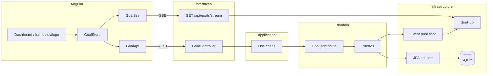

# Arquitectura

Un proceso Spring Boot (hexagonal lean) y Angular aparte. Un aggregate: `Goal`. La regla `current + amount ≤ target` vive en `Goal.contribute()`, no en el controller ni en SQL.

Flujo: REST → use case → `Goal` → `save` → `publish`. El aviso no sale del use case: evento de dominio → listener → `SseHub` → `EventSource`. El `@Entity` es DTO de tabla; el aggregate se reconstruye con `Goal.rehydrate`.

---

## ¿Por qué esta arquitectura para el caso de negocio?

El negocio es una meta de ahorro y sus abonos: no superar el objetivo, no abonar una meta cerrada, y avisar al llegar al 100%. Eso es **un invariante sobre un solo aggregate**, no un catálogo de productos ni un sistema de usuarios.

Hexagonal lean encaja porque:

- La regla no puede vivir en el controller (se saltaría con otro cliente).
- **Sí cambian** cómo se guarda (SQLite hoy) y cómo se avisa (SSE hoy).
- Un deploy basta: un flujo de escritura (REST) y un flujo de aviso (SSE).

Un `@Service` Spring con JPA mezclaría el invariante con el framework. Microservicios partirían en dos un cambio que tiene que ser atómico (`current` y `status` juntos).

## ¿Qué alternativas descarté y qué trade-offs asumí?

**Descartada A — Layered Spring clásico.** Más velocidad de entrega al inicio (todo en un `@Service`). Más acoplamiento: la regla queda junto a transacciones y DTOs. Mantenibilidad peor cuando cambia el motor o el canal de aviso. Complejidad aparente baja; complejidad real en tests (hay que levantar Spring para un `if`).

**Descartada C — Microservicios / broker.** Menos acoplamiento de procesos, más complejidad operativa (red, contratos, fallos parciales). Para un abono no hay segundo bounded context. Entrega más lenta sin mejorar el invariante.

**Elegida B — monolito hexagonal lean.**

| Eje | Qué se asumió |
| --- | --- |
| Complejidad vs mantenibilidad | Un módulo extra (`domain` / puertos) a cambio de tests de regla sin Spring y de poder cambiar adapters |
| Acoplamiento vs velocidad de entrega | El dominio no conoce JPA ni SSE (menos acoplamiento). SQLite + SSE en memoria: entrega rápida del demo; no es el runtime de carga |

Otros recortes: sin JWT (no hay identidad en las HU), SSE sin outbox (si el push falla el abono ya está), sin WebSocket (el comando ya es HTTP), sin NgRx (un `GoalStore` de signals alcanza).

## ¿Cómo se aíslan las reglas del framework y de la infraestructura?

Están en `Goal.contribute()`: monto > 0, no `COMPLETED`, `current + amount ≤ target`; al completar, status `COMPLETED` y eventos `GoalUpdatedEvent` / `GoalCompletedEvent`.

El paquete `domain` no importa `org.springframework` ni `jakarta.persistence`. El controller traduce HTTP ↔ use case. `GoalJpaEntity` es el mapeo de tabla; `Goal.rehydrate` arma el aggregate. Los tests `GoalContributeTest` no levantan el contexto: si el `if` se mueve al controller, esos tests no lo cubren.

---

## Patrones (en código)

Mínimo dos; hay tres usados de verdad.

**Repository.** Puerto `GoalRepository` (`save`, `findById`, `findAll`). Runtime: `JpaGoalRepositoryAdapter`. Tests: `InMemoryGoalRepository`. El use case no conoce SQL.

**Observer / Domain Event.** `Goal` no llama a SSE. Publica hechos. `SpringGoalEventPublisher` implementa `GoalEventPublisher` y delega en `ApplicationEventPublisher`. `GoalEventSseListener` observa y hace `SseHub.broadcast`. Otro canal (mail) sería otro listener.

**Adapter.** JPA, SSE y REST están en el borde. El hexágono es puertos adentro, adapters afuera.

---

## Tiempo real

Comandos por REST (`POST /api/goals`, `POST .../contributions`). Avisos por SSE (`GET /api/goals/stream`: `goal-updated`, `goal-completed`). SSE es servidor→browser; WebSocket no aporta. El diálogo de 100% se abre con `goal-completed` del stream, no con el JSON del POST. Si el push falla, el abono ya está persistido.

## Persistencia y BD

SQLite en `apps/backend/data/bolsillo.db`. `schema.sql` (`ddl-auto: none`): `NUMERIC`, `CHECK` de `current ≤ target` y `status`. El CHECK no sustituye a `Goal`. `data.sql` siembra dos metas. UUID en el dominio, antes del INSERT. `@Version` → 409. El puerto permite Postgres sin tocar `contribute()`.

## Testing

1. **Dominio** (`GoalContributeTest`): JUnit, sin Spring.
2. **HTTP** (MockMvc): un método por caso (201, seed, 200, 400, 422, 100%, concurrencia).
3. **Angular** (`enunciado.spec.ts`): dashboard, abono inválido sin POST, % de la card, diálogo al `goal-completed`.
